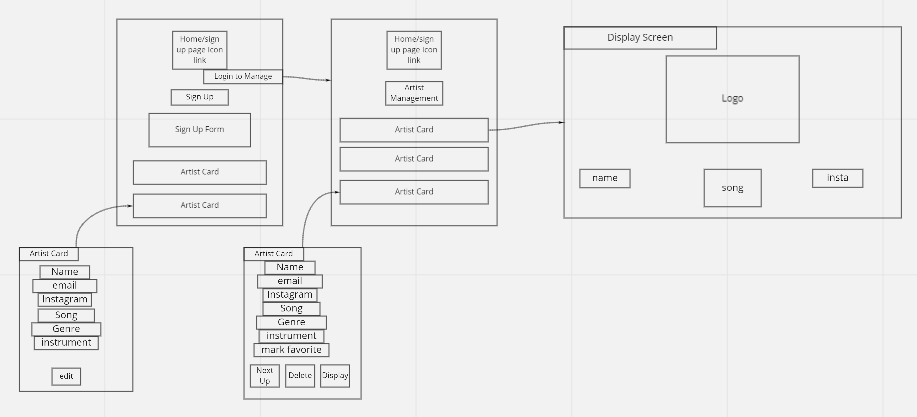

# Pitchmeeting-project 

This App is an artist managment tool that makes it easy to manage a artist interested in performing at an open mic night. The idea originated from a friend who started an open mic night for artists to perform their original music with a live band. The functionallity of this App is meant to be simple and easy to use.

This App was built with the ReactJS library and styled with CSS.

This application is built for my Front-End/Client-Side Capstone project for Nashville Software School.

# Getting Started with Create React App

This project was bootstrapped with [Create React App](https://github.com/facebook/create-react-app).

## Pitch Meeting App Setup:

1. Use terminal to clone this repository
2. `cd` into the directory it creates
```
git clone git@github.com:AlexLam12/pitchmeeting
cd pitchmeeting/
```
3. Run `npm install` and wait for all dependencies to be installed.
4. Run `npm start` to verify that installation was successful.
5. Create an `api` directory outside of the project directory.
6. Create a `database.json` file.
7. Copy and Paste the following data into the json file:

```json
{
  "users": [
    {
      "id": 1,
      "name": "Alex",
      "email": "Alex@gmail.com"
    }
  ],
  "artists": [
    {
      "id": 1,
      "name": "Black Pumas",
      "email": "BP@gmail.com",
      "instagram": "@BP",
      "instrument": "all",
      "song": "Colors",
      "genre": "indie",
      "date": 16288714146367
    },
    {
      "id": 4,
      "name": "Cherub",
      "email": "Cher@gmail.com",
      "instagram": "@cherub",
      "instrument": "none",
      "song": "Doses & Minmosas",
      "genre": "Hip-hop",
      "date": 16288714146367
    }
  ],
  "likes": [
    {
      "id": 1,
      "userId": 1,
      "artistId": 4
    }
  ]
}
```
8. Run `json-server -p 8088 -w database.json` from the api directory.

## Project ERD (Entity Relationship Diagram):

Link: https://dbdiagram.io/d/60f629e34ed9be1c05d3a275


## Project Wireframe:

Link: https://miro.com/app/board/o9J_l5ob3qY=/?fromRedirect=1



## In the project directory, you can run:

### `npm start`

Runs the app in the development mode.\
Open [http://localhost:3000](http://localhost:3000) to view it in the browser.

The page will reload if you make edits.\
You will also see any lint errors in the console.

### `npm test`

Launches the test runner in the interactive watch mode.\
See the section about [running tests](https://facebook.github.io/create-react-app/docs/running-tests) for more information.

### `npm run build`

Builds the app for production to the `build` folder.\
It correctly bundles React in production mode and optimizes the build for the best performance.

The build is minified and the filenames include the hashes.\
Your app is ready to be deployed!

See the section about [deployment](https://facebook.github.io/create-react-app/docs/deployment) for more information.

### `npm run eject`

**Note: this is a one-way operation. Once you `eject`, you can’t go back!**

If you aren’t satisfied with the build tool and configuration choices, you can `eject` at any time. This command will remove the single build dependency from your project.

Instead, it will copy all the configuration files and the transitive dependencies (webpack, Babel, ESLint, etc) right into your project so you have full control over them. All of the commands except `eject` will still work, but they will point to the copied scripts so you can tweak them. At this point you’re on your own.

You don’t have to ever use `eject`. The curated feature set is suitable for small and middle deployments, and you shouldn’t feel obligated to use this feature. However we understand that this tool wouldn’t be useful if you couldn’t customize it when you are ready for it.

## Learn More

You can learn more in the [Create React App documentation](https://facebook.github.io/create-react-app/docs/getting-started).

To learn React, check out the [React documentation](https://reactjs.org/).

### Code Splitting

This section has moved here: [https://facebook.github.io/create-react-app/docs/code-splitting](https://facebook.github.io/create-react-app/docs/code-splitting)

### Analyzing the Bundle Size

This section has moved here: [https://facebook.github.io/create-react-app/docs/analyzing-the-bundle-size](https://facebook.github.io/create-react-app/docs/analyzing-the-bundle-size)

### Making a Progressive Web App

This section has moved here: [https://facebook.github.io/create-react-app/docs/making-a-progressive-web-app](https://facebook.github.io/create-react-app/docs/making-a-progressive-web-app)

### Advanced Configuration

This section has moved here: [https://facebook.github.io/create-react-app/docs/advanced-configuration](https://facebook.github.io/create-react-app/docs/advanced-configuration)

### Deployment

This section has moved here: [https://facebook.github.io/create-react-app/docs/deployment](https://facebook.github.io/create-react-app/docs/deployment)

### `npm run build` fails to minify

This section has moved here: [https://facebook.github.io/create-react-app/docs/troubleshooting#npm-run-build-fails-to-minify](https://facebook.github.io/create-react-app/docs/troubleshooting#npm-run-build-fails-to-minify)
# pitchmeeting
